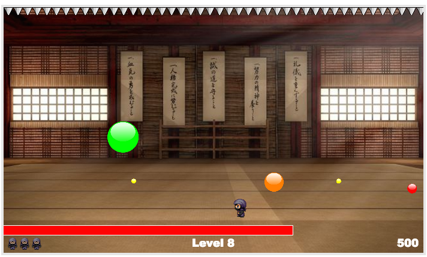

# Ninja Pop

[Live](www.andrewpark.site/ninjapop)

## Description

NinjaPop is an arcade style game inspired by [Bubble Trouble](http://www.miniclip.com/games/bubble-trouble/en/#t-w-c-H). The game is
written in JavaScript and uses HTML5 for canvas rendering. The objective of the game is to pop all the bubbles before the timer runs out.
The player first chooses the ninja of his/her choice and starts off with 5 lives. To win, the ninja must defeat all 10 levels.
Only then, can you be true ninja master. Enjoy!

## Screenshots

